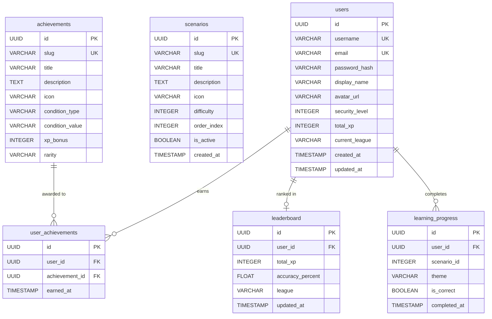

# CyberShield — Образовательный симулятор кибербезопасности

> Интерактивная платформа для обучения основам кибербезопасности через геймифицированные сценарии и систему достижений.

## Содержание

- [Описание](#описание)
- [Возможности](#возможности)
- [Технологический стек](#технологический-стек)
- [Архитектура](#архитектура)
- [Быстрый старт](#быстрый-старт)
- [Структура проекта](#структура-проекта)
- [База данных](#база-данных)
- [API документация](#api-документация)
- [Развёртывание](#развёртывание)
- [Переменные окружения](#переменные-окружения)

## Описание

CyberShield — это образовательная платформа, которая обучает пользователей основам кибербезопасности через интерактивные сценарии. Пользователи отвечают на вопросы, связанные с реальными угрозами: фишинг, скимминг, подбор паролей, социальная инженерия.

Платформа включает систему геймификации с опытом (XP), уровнями безопасности, лигами и достижениями, что мотивирует пользователей продолжать обучение.

## Возможности

- **Интерактивные сценарии** — реалистичные ситуации кибератак с ветвящимися сюжетами
- **Обучающие модули** — теоретический материал по 4 темам: фишинг, скимминг, подбор паролей, социальная инженерия
- **Геймификация** — система XP, уровней безопасности и лиг (от новичка до эксперта)
- **Достижения** — награды за прогресс и мастерство
- **Таблица лидеров** — соревнование с другими пользователями
- **Дашборд прогресса** — визуализация статистики и истории прохождения
- **JWT-аутентификация** — безопасная система входа с refresh-токенами

## Технологический стек

### Backend
| Технология | Назначение |
|---|---|
| **FastAPI** 0.109 | Веб-фреймворк |
| **SQLAlchemy** 2.0 | ORM |
| **AsyncPG** | Асинхронный драйвер PostgreSQL |
| **Alembic** | Миграции базы данных |
| **Pydantic** | Валидация данных |
| **Redis** | Кэширование и хранение refresh-токенов |
| **python-jose** | JWT-токены |
| **Passlib + Bcrypt** | Хеширование паролей |
| **WebSockets** | Реалтайм-коммуникация |

### Frontend
| Технология | Назначение |
|---|---|
| **Next.js** 14 | React-фреймворк (App Router) |
| **TypeScript** | Типизация |
| **TailwindCSS** | Стилизация |
| **Zustand** | Управление состоянием |
| **Framer Motion** | Анимации |
| **Recharts** | Графики и визуализация |
| **Radix UI** | Доступные компоненты |
| **Lucide React** | Иконки |
| **Axios** | HTTP-клиент |

### Инфраструктура
| Технология | Назначение |
|---|---|
| **PostgreSQL** 16 | Основная база данных |
| **Redis** 7 | Кэш и сессии |
| **Docker Compose** | Оркестрация контейнеров |
| **Nginx** | Reverse proxy (production) |

## Архитектура

```
┌─────────────────┐     HTTP/WS      ┌──────────────────┐
│   Frontend      │ ◄──────────────► │     Backend      │
│   Next.js :3000 │                  │   FastAPI :8000  │
└─────────────────┘                  └────────┬─────────┘
                                              │
                    ┌─────────────────────────┼──────────────┐
                    ▼                         ▼              ▼
            ┌───────────────┐        ┌──────────────┐ ┌──────────┐
            │  PostgreSQL   │        │    Redis     │ │ Alembic  │
            │   :5432       │        │   :6379      │ │ Migrations│
            └───────────────┘        └──────────────┘ └──────────┘
```

## Быстрый старт

### Предварительные требования

- Docker и Docker Compose
- Python 3.11+ (для локальной разработки)
- Node.js 18+ (для локальной разработки)

### Запуск через Docker Compose

```bash
# Клонирование репозитория
git clone <repository-url>
cd DLYA-KUL-KA

# Запуск всех сервисов
docker compose up --build

# Приложение доступно:
# Frontend: http://localhost:3000
# Backend API: http://localhost:8000
# Swagger UI: http://localhost:8000/docs
```

### Локальная разработка

**Backend:**
```bash
cd backend
python -m venv venv
source venv/bin/activate  # Linux/macOS
# или
venv\Scripts\activate     # Windows

pip install -r requirements.txt
cp .env.example .env

# Запуск базы данных и Redis
docker compose up db redis -d

# Миграции и сидирование
alembic upgrade head
python -m app.seed.seed_scenarios

# Запуск сервера
uvicorn app.main:app --reload --port 8000
```

**Frontend:**
```bash
cd frontend
npm install
npm run dev
```

## Структура проекта

```
DLYA-KUL-KA/
├── backend/                    # Backend-приложение (FastAPI)
│   ├── app/
│   │   ├── config.py           # Настройки приложения
│   │   ├── database.py         # Подключение к БД
│   │   ├── main.py             # Точка входа FastAPI
│   │   ├── middleware/         # Middleware (аутентификация)
│   │   │   └── auth.py         # JWT-проверка токенов
│   │   ├── models/             # SQLAlchemy-модели
│   │   │   ├── user.py         # Модель пользователя
│   │   │   ├── scenario.py     # Сценарии
│   │   │   ├── achievement.py  # Достижения
│   │   │   ├── leaderboard.py  # Таблица лидеров
│   │   │   └── learning_progress.py # Прогресс обучения
│   │   ├── schemas/            # Pydantic-схемы
│   │   ├── routers/            # API-роутеры
│   │   │   ├── auth.py         # Аутентификация
│   │   │   ├── scenarios.py    # Сценарии
│   │   │   ├── progress.py     # Прогресс
│   │   │   ├── leaderboard.py  # Лидерборд
│   │   │   ├── achievements.py # Достижения
│   │   │   ├── learning.py     # Обучение
│   │   │   └── ws.py           # WebSocket
│   │   ├── services/           # Бизнес-логика
│   │   ├── data/               # Данные (обучающие модули)
│   │   └── seed/               # Сидирование БД
│   ├── alembic/                # Миграции
│   ├── requirements.txt
│   └── Dockerfile
├── frontend/                   # Frontend-приложение (Next.js)
│   ├── src/
│   │   ├── app/                # Маршруты (App Router)
│   │   │   ├── dashboard/      # Дашборд пользователя
│   │   │   ├── leaderboard/    # Таблица лидеров
│   │   │   ├── learning/       # Обучающие модули
│   │   │   ├── login/          # Страница входа
│   │   │   ├── profile/        # Профиль пользователя
│   │   │   ├── register/       # Страница регистрации
│   │   │   ├── scenarios/      # Список сценариев
│   │   │   └── theory/         # Теоретический материал
│   │   ├── components/         # React-компоненты
│   │   ├── lib/                # Утилиты
│   │   │   ├── api.ts          # Axios-клиент
│   │   │   ├── utils.ts        # Вспомогательные функции
│   │   │   └── ws.ts           # WebSocket-клиент
│   │   ├── stores/             # Zustand-хранилища
│   │   │   ├── authStore.ts    # Состояние аутентификации
│   │   │   ├── learningStore.ts # Состояние обучения
│   │   │   └── progressStore.ts # Состояние прогресса
│   │   └── types/              # TypeScript-типы
│   ├── public/                 # Статические файлы
│   ├── package.json
│   └── Dockerfile
├── nginx/                      # Конфигурация Nginx (production)
├── docker-compose.yml          # Локальная конфигурация
├── docker-compose.prod.yml     # Production-конфигурация
├── deploy.sh                   # Скрипт развёртывания (Linux)
├── deploy-windows.bat          # Скрипт развёртывания (Windows)
└── .env.example                # Пример переменных окружения
```

## База данных

Проект использует PostgreSQL 16 с асинхронным подключением через SQLAlchemy 2.0.

### ER-диаграмма



### Описание таблиц

| Таблица | Описание |
|---|---|
| `users` | Профили пользователей с геймификационными метриками (XP, уровень безопасности, лига) |
| `scenarios` | Учебные сценарии (фишинг, скимминг, подбор паролей, социальная инженерия) |
| `achievements` | Каталог достижений с условиями получения |
| `user_achievements` | Связь пользователей с полученными достижениями |
| `leaderboard` | Агрегированная статистика для таблицы лидеров |
| `learning_progress` | Прогресс прохождения обучающих модулей по темам |

## API документация

Полная спецификация API доступна в формате OpenAPI 3.0 после запуска приложения:

- **Swagger UI**: `http://localhost:8000/docs`
- **OpenAPI JSON**: `http://localhost:8000/openapi.json`

### Краткий обзор эндпоинтов

| Метод | Путь | Описание | Auth |
|---|---|---|---|
| POST | `/api/auth/register` | Регистрация нового пользователя | Нет |
| POST | `/api/auth/login` | Вход в систему | Нет |
| POST | `/api/auth/refresh` | Обновление access-токена | Нет |
| GET | `/api/auth/me` | Получение данных профиля | Да |
| PUT | `/api/auth/me` | Обновление профиля | Да |
| POST | `/api/auth/logout` | Выход из системы | Да |
| GET | `/api/scenarios/` | Список всех сценариев | Да |
| GET | `/api/scenarios/{slug}` | Детали сценария | Да |
| GET | `/api/progress/` | Сводка прогресса | Да |
| GET | `/api/progress/dashboard` | Данные дашборда | Да |
| GET | `/api/progress/history` | История прохождения | Да |
| GET | `/api/leaderboard/` | Таблица лидеров | Да |
| GET | `/api/leaderboard/leagues` | Лиги и рейтинги | Да |
| GET | `/api/achievements/` | Все достижения | Да |
| GET | `/api/achievements/my` | Мои достижения | Да |
| GET | `/api/learning/themes` | Темы обучения | Да |
| GET | `/api/learning/modules` | Все модули | Да |
| GET | `/api/learning/modules/{id}` | Детали модуля | Да |
| POST | `/api/learning/submit` | Отправка ответа | Да |
| GET | `/api/learning/dashboard` | Дашборд обучения | Да |
| GET | `/api/learning/activity` | Активность (140 дней) | Да |
| GET | `/api/learning/stats` | Статистика обучения | Да |

### Аутентификация

API использует JWT-токены (access + refresh):

- **Access token**: действует 30 минут, передаётся в заголовке `Authorization: Bearer <token>`
- **Refresh token**: действует 7 дней, хранится в Redis, используется для обновления access-токена

### Развёртывание

### Production

Для production-развёртывания используется `docker-compose.prod.yml` с Nginx в качестве reverse proxy:

```bash
# Настройка VDS (Ubuntu)
./setup-vds.sh

# Развёртывание
./deploy.sh

# Настройка SSL (Let's Encrypt)
./setup-ssl.sh

# Проверка статуса
./status.sh

# Просмотр логов
./logs.sh
```

### Переменные окружения

| Переменная | Описание | По умолчанию |
|---|---|---|
| `DATABASE_URL` | URL подключения к PostgreSQL | `postgresql+asyncpg://postgres:postgres@db:5432/cybershield` |
| `REDIS_URL` | URL подключения к Redis | `redis://redis:6379/0` |
| `SECRET_KEY` | Секретный ключ для JWT | `cybershield-hackathon-secret-key-2024` |
| `CORS_ORIGINS` | Разрешённые CORS-источники | `http://localhost:3000` |
| `NEXT_PUBLIC_API_URL` | URL backend API для фронтенда | `http://localhost:8000` |
| `NEXT_PUBLIC_WS_URL` | URL WebSocket для фронтенда | `ws://localhost:8000` |
